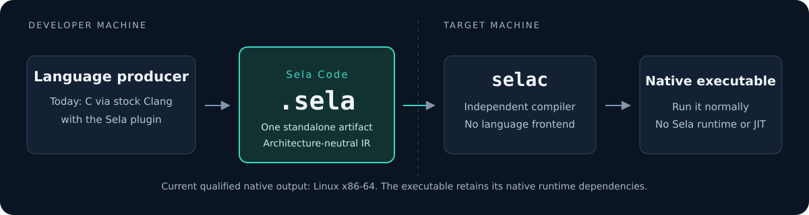
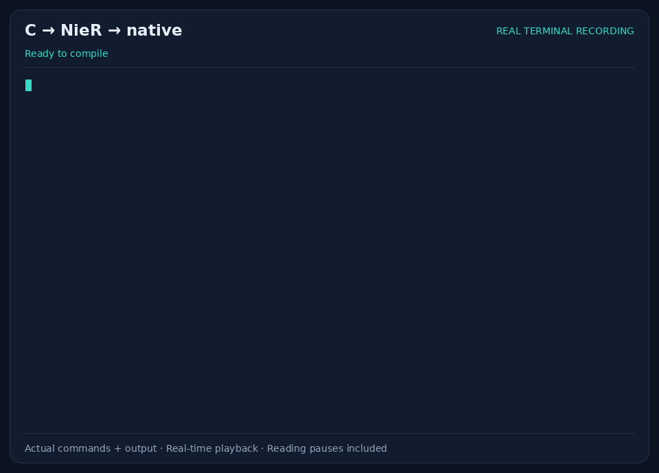

<p align="center">
  
</p>

<h1 align="center">Architecture-neutral code. Native execution.</h1>

<p align="center">
  Publish a standalone Sela artifact. Compile it into an ordinary native binary on the target.
</p>

<p align="center">
  <a href="https://github.com/GhostDog788/Sela/actions/workflows/ci.yml"></a>
  <a href="#project-status"></a>
  <a href="docs/reference/adding-native-targets.md"></a>
  <a href="LICENSE"></a>
</p>

<p align="center">
  <a href="#quickstart">Quickstart</a> ·
  <a href="docs/README.md">Documentation</a> ·
  <a href="examples/hello/README.md">Examples</a> ·
  <a href="#project-status">Project status</a> ·
  <a href="CONTRIBUTING.md">Contributing</a>
</p>

## What is Sela?

Sela is an open-source native publication toolchain built around **Sela Code**: an independent, architecture-neutral intermediate representation implemented with MLIR.
A language producer emits one `.sela` artifact; the separate, language-blind `selac` compiler turns it into native output using LLVM.

- **A portable publication format.** Publish Sela Code independently of the language frontend and device compiler.
- **Ordinary native execution.** Run the compiled program without a Sela interpreter, JIT, or resident compiler.
- **Familiar C projects.** The current producer uses stock Clang with a plugin, with Make or CMake integration for qualified projects.

Sela's goal is a shared format that many languages can target.
Today's working implementation is a bounded C/Linux toolchain, not every language, program, or CPU.
This is **pre-alpha**: artifacts and APIs may change completely between commits, with no backward-compatibility guarantees.

**SESela**, shortened to **SES**, is the planned security platform layered above Sela.
The `SE` prefix follows the naming pattern of SELinux.
Sela works independently; SES will add security enforcement without becoming a requirement for publication, compilation, or native execution.

## How it works



The artifact is the boundary between publication and native compilation.
`selac` does not need the original C sources or a C frontend.
The final executable uses its normal native loader and runtime dependencies; the toolchain does not install those dependencies automatically.

## See it run



An actual local source-to-native run, with reading pauses in the animation—not a compilation-speed benchmark.
[Read the captured transcript](assets/hello-demo.txt), or follow the [Hello project walkthrough](docs/guides/02-toolchain-users/hello-project-walkthrough.md).
The walkthrough offers **Make or CMake**; choose one and add only its publication configuration.

## Quickstart

Use Bash from the repository root on **x86-64 Ubuntu 24.04**.
Check the [host prerequisites](docs/reference/development-sdk.md) first.
Build the tools once:

```bash
bash scripts/bootstrap-sdk.sh
source sdk/env.sh
cmake --preset prealpha
cmake --build --preset prealpha
```

Bootstrap downloads hash-pinned packages into the local `.sdk`; it does not replace your system compiler.
In a new terminal, source `sdk/env.sh` again before using the development toolchain.

Publish the two-file Hello program, compile the artifact, and run it:

```bash
hello_work=$(mktemp -d "${TMPDIR:-/tmp}/sela-hello-XXXXXX")
clang --config="$PWD/build/prealpha/sela.cfg" -O2 \
  examples/hello/hello/main.c examples/hello/hello/hello.c \
  -o "$hello_work/hello.sela"
build/prealpha/selac "$hello_work/hello.sela" -o "$hello_work/hello"
env -u LD_LIBRARY_PATH -u LD_PRELOAD "$hello_work/hello"
```

Expected application output: `Hello world`.

This quickstart uses one machine for both separate compiler invocations.
Keep the SDK/runtime in place when running the executable.
For an existing application, use [Publish your C project with Sela](docs/guides/02-toolchain-users/using-sela-with-your-c-project.md), which preserves native build-time probes and generators.

## Project status

| Area | Current scope |
| --- | --- |
| Format and compiler | Independent `.sela` artifacts, public producer APIs, and a separate LLVM-based `selac`. |
| C publication | Stock-Clang plugin; qualified Make/CMake builds; executable, shared-library, and static-archive outputs. |
| Native targets | Separate x86-64, i686, ARMv7 hard-float, and AArch64 Linux/glibc compiler bundles; the new target-specific core matrix passes in four matching-kernel VMs. |
| Target-specific C | Selected architecture sets, differing native build graphs, fixed vectors, selected intrinsics, inline assembly/asm goto, and constructors. This increment is partially implemented. |
| Still being qualified | Standalone/file-scope assembly, CPU compatibility admission, general C/ABI coverage, complete corpus regression, native-equivalent performance, and reverse-engineering resistance. |
| Planned | More languages and targets; production distribution; SESela (SES) for signing and executable-memory security enforcement. |

The [current status reference](docs/reference/toolchain-status.md) explains the boundaries and failure behavior.
The [qualification reference](docs/reference/qualification-corpus.md) records passing cJSON and zlib checkpoints; it does not imply that every later commit has rerun the full corpus.
The [target-specific C checkpoint](docs/reference/target-c-checkpoint.md) distinguishes this increment's passing tests, failed attempts, and unfinished work.
SES security enforcement is a separate axis, not a requirement for using today's Sela toolchain.

Run the focused CI smoke suite after building:

```bash
bash scripts/ci-smoke.sh
```

This is a bounded regression check, not full corpus or performance qualification.
See the [requirements](docs/01-architecture-design.md), [implementation plan](docs/02-implementation-plan.md), and [testing guide](docs/guides/03-contributors/14-testing-debugging-and-features.md) for the complete scope.

## Learn and contribute

- [Hello project walkthrough](docs/guides/02-toolchain-users/hello-project-walkthrough.md) — try the starter project and compare your chosen integration with the solution.
- [Publish your own C project](docs/guides/02-toolchain-users/using-sela-with-your-c-project.md) — integrate an existing Make or CMake build.
- [Publish target-specific C](docs/guides/02-toolchain-users/target-specific-c.md) — select architectures and preserve native target choices.
- [Guide series](docs/guides/README.md) — learn Sela Code, then follow the implementation.
- [Build and VS Code setup](docs/reference/building-sela.md) — configure the SDK and editor.
- [Compiler-only distribution](docs/reference/compiler-distribution.md) — package the independent consumer.
- [Contributing](CONTRIBUTING.md) — development expectations, tests, and pull requests.
- [Security policy](SECURITY.md) — report suspected vulnerabilities safely.

Open `docs/` as the Obsidian vault and the repository root in VS Code.
The guides retain their vault-local Markdown links; source paths are for the code editor.

## License

Sela's project-owned code and documentation are available under the [Apache License 2.0](LICENSE).
Use, modify, and redistribute them, including commercially, under that license's terms.
Third-party components retain their own licenses and notices.

“Source-private” means published application artifacts exclude the original source; the Sela toolchain itself is open source.
